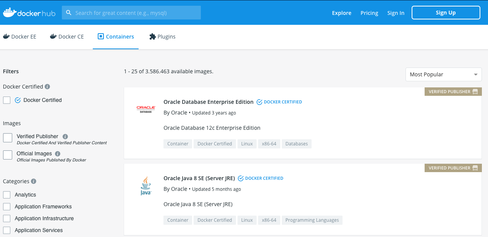
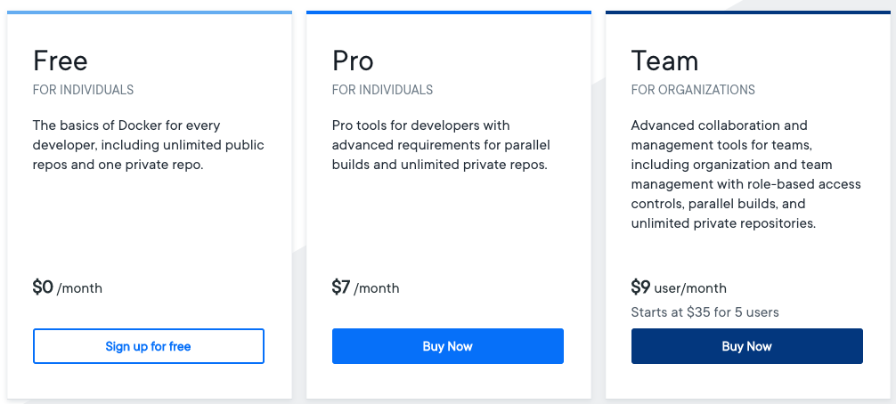

# Configuração Docker Hub

O Docker Hub (https://hub.docker.com/) é um repositório remoto de imagem de container docker, possui uma grande quantidade de imagens, Figura 01, pré-configuradas facilitando a vida dos desenvolvedores.

<h4 align="middle">Figura 01 - Docker Hub</h4>

Existe ainda a possibilidade da criação de um cadastro e hospedagem de imagens personalizadas, caso queira disponibilizar uma aplicação para testes, ou até mesmo criar um ambiente de produção, o Docker Hub possui 03 planos de assinatura, Figura 02:

<h4 align="middle">Figura 02 - Planos Docker Hub</h4>

 

[Início](/README.md)