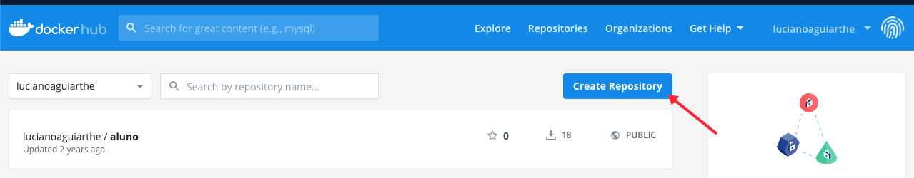

# Configuração Docker Hub

O Docker Hub (https://hub.docker.com/) é um repositório remoto de imagem de container docker, possui uma grande quantidade de imagens, Figura 01, pré-configuradas facilitando a vida dos desenvolvedores.

<h4 align="middle">Figura 01 - Docker Hub</h4>

Existe ainda a possibilidade da criação de um cadastro e hospedagem de imagens personalizadas, caso queira disponibilizar uma aplicação para testes, ou até mesmo criar um ambiente de produção, o Docker Hub possui 03 planos de assinatura, Figura 02:

<h4 align="middle">Figura 02 - Planos Docker Hub</h4>

Para criação de um repositório remoto público crie uma conta de usuário e logue no Docker Hub, será exibo um Dashboard com todos os repositórios de imagens da conta, Figura 03, é importante pontuar que o nome do repositório deve ser o mesmo do nome da imagem, para criar um repositório clique no botão <b>Create Repository</b>.

<h4 align="middle">Figura 03 - Docker Hub</h4>
 
 
 
Atribua um nome ao repositório que será criado, ratificando que o nome do repositório é o mesmo da imagem que será enviada.

 

<h4 align="middle">Figura 04 - Criação de Repositório</h4>

 
Ao concluir a criação do repositório será exibido o status inclusive com o comando para envio da imagem, Figura 05.

 

<h4 align="middle">Figura 05 - Status do Repositório</h4>

O Docker por padrão não vem configurado enviar imagens ao Docker Hub, necessitando configurar o usuário e senha, para isso utize o comando <b>docker login</b> e informe os dados da conta.

<h4 align="middle">Figura 06 - Configuração Login Docker</h4>

[Início](/README.md)