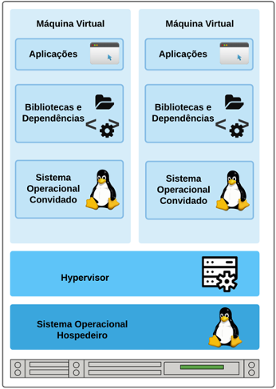
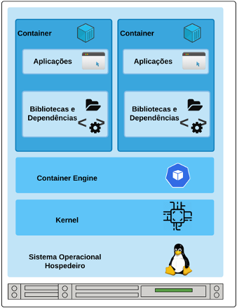

# Instalação Docker

Os containers são baseados em uma técnica de virtualização em nível de sistema operacional que fornece ambientes virtuais utilizando Linux Containers (LCX), facultando o isolamento do processo e da rede por meio de chroot, cgroups e namespaces.

A abordagem de container pode acarretar dúvidas quando comparados com máquinas virtuais (MV). Considerando a semelhança entre os modelos, será apresentado um comparativo em relação ao uso de container e máquinas virtuais.

A Virtualização é o processo de dividir a máquina física em vários componentes virtuais, nos quais cada um pode hospedar sistemas operacionais diferentes, cabendo a gestão destes SO ao hypervisor. A Figura 4 apresenta um ambiente com esta arquitetura. Um aspecto a se ressaltar é o consumo de hardware: cada sistema convidado possui um kernel em execução.

<h4 align="middle">Figura 01 - Máquina Virtual</h4>

Na arquitetura de container, bibliotecas, system calls e recursos do SO hospedeiro são compartilhados com os containers. Neste ambiente, cada container compartilha ainda o mesmo kernel do SO hospedeiro, tornando a sua execução mais rápida. A Figura 5 apresenta um ambiente com esta abordagem executando dois containers.

<h4 align="middle">Figura 02 - Container</h4>

Funcionalmente, cada componente destacado a seguir proporciona uma estrutura para a execução do SO no container:

*	chroot – disponibiliza um diretório-raiz;
*	cgroups – fornecem mecanismos para contabilizar e limitar os recursos que os processos podem utilizar em cada container (BUI, 2015);
*	namespaces – criam grupos de processos de maneira que um grupo de processo não seja visualizado por outro, garantindo o isolamento dos containers. 

## INSTALAÇÃO DO DOCKER

Atualize o índice do pacote apt e instale pacotes para permitir que o apt use um repositório através de HTTPS:

<b>apt-get install -y
    apt-transport-https 
    ca-certificates 
    curl 
    gnupg-agent 
    software-properties-common</b>

Adicione a chave GPG oficial do Docker:

<b>curl -fsSL https://download.docker.com/linux/debian/gpg | apt-key add - </b>

Verifique se agora você possui a chave com a impressão digital <b>9DC8 5822 9FC7 DD38 854A E2D8 8D81 803C 0EBF CD88</b>, pesquisando os últimos 8 caracteres da impressão digital:

<b>apt-key fingerprint 0EBFCD88</b>

Adicione o repositório estável para instalação dos pacotes docker do debian.

<b>add-apt-repository 
   "deb [arch=amd64] https://download.docker.com/linux/debian 
   $(lsb_release -cs) 
   stable"</b>

Atuelize os pacotes do Sistema Operacional:
   

<b> apt-get update</b>

   

Instale os pacotes necessários para execução docker:

<b>apt-get install -y docker-ce docker-ce-cli containerd.io </b>

Para verificar a versão do docker digite: docker -v

<h4 align="middle">Figura 03 - Versão Docker</h4>

