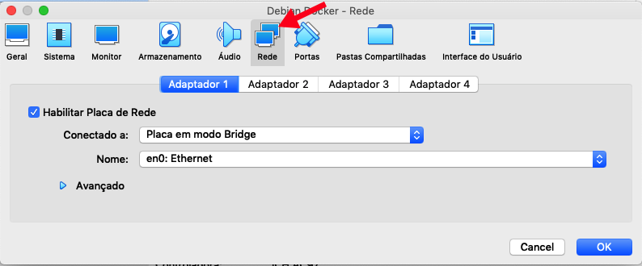
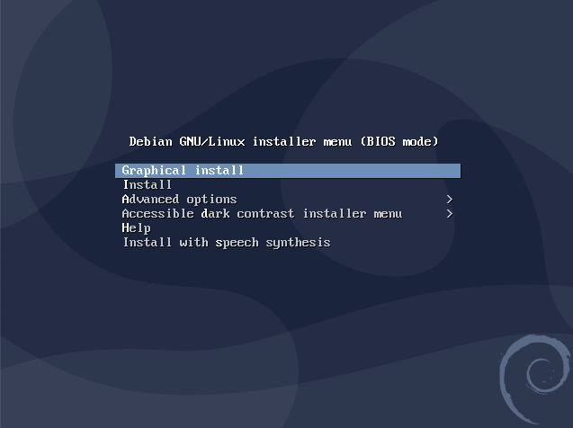
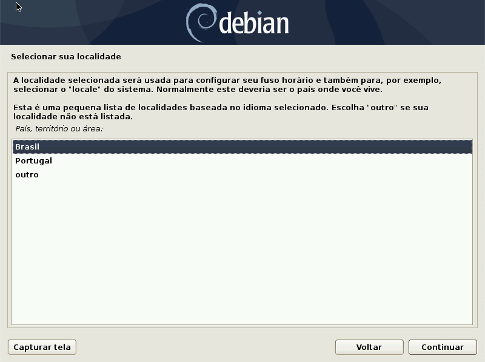
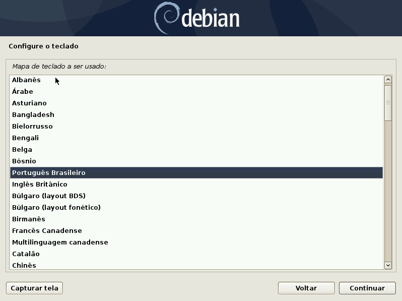
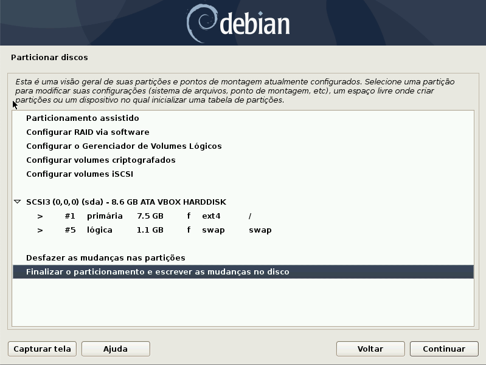
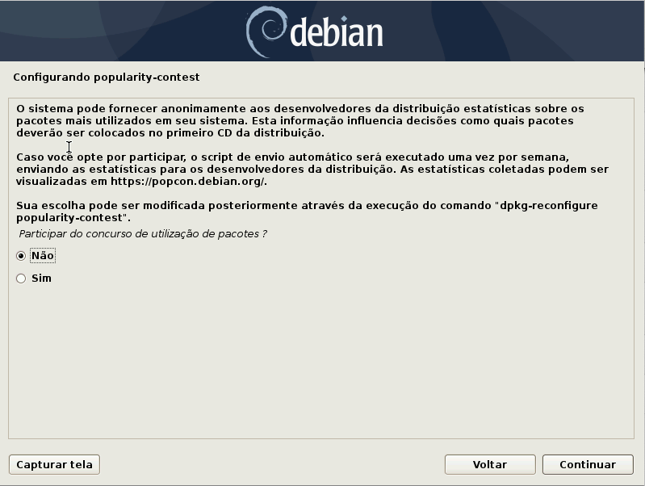
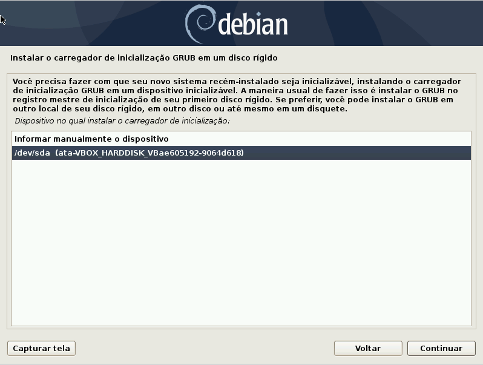

# Instalação Sistema Operacional Debian

Para  disponibilizar um ambiente virtualizado se faz necessário o download de um software de virtualizado, o adotado no presente material é o VirtualBox da Oracle, o dowload da aplicação pode ser realizado no endereço abaixo:

[VirtualBox](https://www.virtualbox.org/) 

O procedimento de instação é muito simples, seguindo as telas de avançar, conforme aplicações padrões do Windows. O Sistema Operacional adotado para execução do Docker é o Debian, em sua versão 10.4, recomenda-se baixar a versão netinst, que possui os pacotes básicos e caso seja necessários realizar o downloads dos demais pacotes através da internet:

[Debian 10.4.0 Netinst](https://cdimage.debian.org/debian-cd/current/amd64/iso-cd/debian-10.4.0-amd64-netinst.iso) 

Para criar uma Máquina Virtual, que é o ambiente onde será instalado o Sistema Operacinal selecione o Menu <b>Máquina</b> e <b>Novo</b>, conforme Figura 1, Atribua um nome para a Máquina Virtual e selecione o botão continuar.

<h4 align="middle">Figura 01 - Criação VM</h4>

Informe também o tamanho da memória que será alocado para a máquina virtual, tenha cuidado deixe uma reserva de 70% da memória para o Sistema Operacional Hospedeiro.

<h4 align="middle">Figura 02 - Tamanho da Memória</h4>

Deve ser informado se informado se será criado um novo disco ou utilizaod um existente, em nosso ambiente criaremos um novo disco, conforme Figura 03:

<h4 align="middle">Figura 03 - Criação de Disco Rígido</h4>

Informe ainda que tipo de arquivo de disco será criado, deixe marcado a opção default, VDI, conforme Figura 04:

<h4 align="middle">Figura 04 - Tipo de Arquivo de Disco</h4>

Selecione se o arquivo de disco será <b>Dinamicamente Alocado</b> ou de <b>Tamanho Fixo</b>, o recomendável é o Dinamicamente Alocado, considerando a economicidade de tamanho.

<h4 align="middle">Figura 05 - Armazenamento em Disco Rígido Físico</h4>

Informe a localização do arquivo da VM e o tamanho do disco, o tamanho sugerido de <b>8GB</b>, atende as necessidade do laboratório.

<h4 align="middle">Figura 06 - Localização e Tamanho do Arquivo</h4>

Ao concluir a criação da máquina virtual, altere a configuração da rede para que a VM seja acessa externamenete pelos demais dispositivos do ambente. Para isso, acesso o menu <b>Máquina</b> e <b>Configurações</b>, clique no ícone Rede, conforme apontado pela seta vermelha, Figura 07, em <b>Conectado a: - </b> altere para Placa em modo Bridge e clique em <b>ok</b>.

<h4 align="middle">Figura 07 - Adaptador de Rede</h4>

Inicialize a Máquina Virtual, clicando no botão iniciar, será aberto uma janela, Figura 08, e aponte para o ISO do Debian que foi realizado o Download no início deste documento.

<h4 align="middle">Figura 08 - Selecionar Disco Óptico</h4>

Selecione o tipo de instalador de sua preferência, caso não tenha familiarade, recomendo o instador gráfico do sistema operacional

<h4 align="middle">Figura 09 - Instalador Debian</h4>

Escolhe o idiome de sua preferência para o instalador do Sistema Operacional

<h4 align="middle">Figura 10 - Idioma de Instalação</h4>

Escolha a localidade de instalação

<h4 align="middle">Figura 11 - Localidade</h4>

Selecione o tipo de teclado conforme a configuração do seu dispositivo.

<h4 align="middle">Figura 12 - Mapa de Teclado</h4>

Atribua um nome para a máquina, o mesmo será exibido na rede.

<h4 align="middle">Figura 13 - Nome da Máquina</h4>

Caso seja necessário atribua um nome para o domínio, em nosso laboratório não se faz necessário, essa configuração pode ser realizada posteriormente.

<h4 align="middle">Figura 14 - Nome do Domínio</h4>

Atribua uma senha para o <b>Root</b>, que é o usuário administrador do Sistema Operacional.

<h4 align="middle">Figura 15 - Configuração Senha do Root</h4>

Informe o nome de um usuário que será cadastrado para acesso ao sistema operacional.

<h4 align="middle">Figura 16 - Usuário Sistema Operacional</h4>

Atribua uma senha para o usuário criado no passo anterior.

<h4 align="middle">Figura 17 - Senha Usuário</h4>

Informe a sua região para configuração do fuso horário do relógio.

<h4 align="middle">Figura 18 - Fuso Horário</h4>

Será inicado o procedimento de maior cuidado na instalação do Sistema Operacional, a recomendação para usuários iniciantes é selecionar a opção <b>Assistido - usar o disco inteiro</b>, no qual uma ferramenta de particionamento irá guiá-lo no procedimemento de formatação e criação de partições.

<h4 align="middle">Figura 19 - Método de Particionamento</h4>

Selecione o disco que será realizado o particionamento.

<h4 align="middle">Figura 20 - Disco a Ser Apagado</h4>

O Particionador de disco realiza a divisão do disco conforme necessidade do administrador do sistema operacional, a maneira correta de configuração de um servidor é criar uma partição para cada pasta, como por exemplo: uma partição para a /home, outra para a /var, outra  /tmp. Todavia como é a instação de um Sistema Operacional de teste, iremos selecionar a opção <b>Todos os arquivos em uma partição</b>, Figura 21:

<h4 align="middle">Figura 21 - Particionador de Disco</h4>

Para concluir os procedimentos de particionamentos selecione a opção <b>Finalizar o particionamento e escrever as mudanças no disco</b>, Figura 22:

<h4 align="middle">Figura 22 - Confirmação de Particionamento</h4>

Escreva as mudanças no disco referente a particionamentos marcanco a opção <b>Sim</b> e clicando no botão <b>Continuar</b>.

<h4 align="middle">Figura 23 - Escrever Mudanças no Disco</h4>

Caso tenha mais algum outro CD ou DVD de instação selecione sim e aponte para o dispositivo, para o nosso processo de instação temos somente uma imagem ISO portanto selecione a opção <b>Não</b> e clique em continuar.

<h4 align="middle">Figura 24 - Ler Discos</h4>

Informe qual o país do Espelho que será utilizado para download dos pacotes, Figura 25:

<h4 align="middle">Figura 25 - Repositório Debian</h4>

Informe qual espelho será utilizado para download dos pacotes.

<h4 align="middle">Figura 26 - Espelho do Repositório</h4>

Caso esteja em uma rede corporativa, informe qual o endereço do proxy e a porta, em nosso ambiente virtualizado não se faz necessário.

<h4 align="middle">Figura 27 - Proxy de Rede</h4>

Informe se tem interesse de participar do concurso de Gerenciador de Pacotes.

<h4 align="middle">Figura 28 - Concurso de Realização de Pacotes</h4>

Selecione os sofware que serão utilizados no sistema operacional, em nosso ambiente marque somente <b>servidor ssh</b>.

<h4 align="middle">Figura 29 - Seleção de Software</h4>

O <b>Grub</b> é o carregador de inicalização do Sistema Operacional, obrigatoriamente deve ser instalado para que o Sistema inicialize normalmente, marque a opção <b>Sim</b> e clique em continuar.

<h4 align="middle">Figura 30 - Instalação do Grub</h4>

Selecione o disco que será instalado o Grub, Figura 31:

<h4 align="middle">Figura 31 - Dispositivo de Instalação do Grub</h4>

Finalmente a instalação é concluída, clique no botão <b>Continuar</b> e reinicie o Sistema Operacional.

<h4 align="middle">Figura 32 - Conclusão da Instalação</h4>

[Início](/README.md)